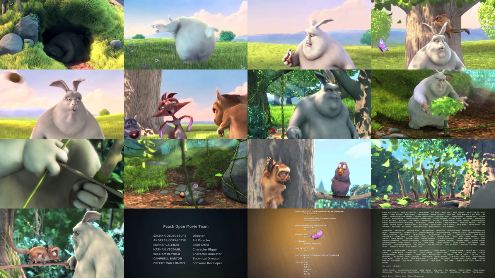

# py-video-thumbnail

Create thumbnail from a video (default 4x4).

## Environment
```bash
$ virtualenv -p python3 venv
$ source venv/bin/activate
$ pip install opencv-python Pillow
```

## Usage

```bash
$ git clone https://github.com/aben20807/py-video-thumbnail.git
$ cd py-video-thumbnail/
$ python pvt.py -i 'BigBuckBunny.mp4'
# Or
$ python pvt.py -d './'
```

```bash
$ python pvt.py -h

Create thumbnail from a video (default 4x4).
usage:
    python pvt.py -d '[video folder]' 2>/dev/null
    details can be accessed by: python pvt.py -h
example:
    python pvt.py -d 'videos/' 2>/dev/null
require:
    pip install opencv-python
    Support Python3
Author:
    Huang Po-Hsuan (aben20807@gmail.com)
GitHub:
    https://github.com/aben20807/py-video-thumbnail

usage: pvt.py [-h] [-s SHAPE] [-k] [-v {0,1,2,3}] [-e EXTENSION] [--info] [--font FONT] [-i INPUT] [-d INPUT_DIR]

Create thumbnail from a video

optional arguments:
  -h, --help            show this help message and exit
  -s SHAPE, --shape SHAPE
                        use NxN grid (default: 4)
  -k, --exist           skip exist (default: True)
  -v {0,1,2,3}, --verbose {0,1,2,3}
                        verbose level (default: 2)
  -e EXTENSION, --extension EXTENSION
                        extensions for video (default: mp4,avi,mkv,m4v,flv,wmv)
  --info                show the info in thumbnail (default: False)
  --font FONT           the path of the custom font (default: )
  -i INPUT, --input INPUT
                        single input (default: )
  -d INPUT_DIR, --input_dir INPUT_DIR
                        folder for processing recursively (default: )
```

## Optional for NAS

```bash
$ sudo mount -t drvfs '\\ben-nas\private' /mnt/share
$ sudo umount /mnt/share
```

## Result


